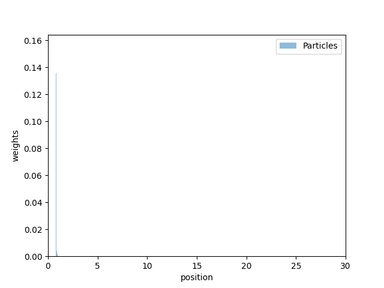
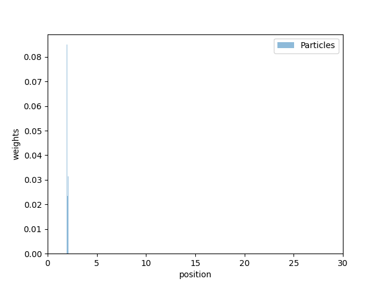
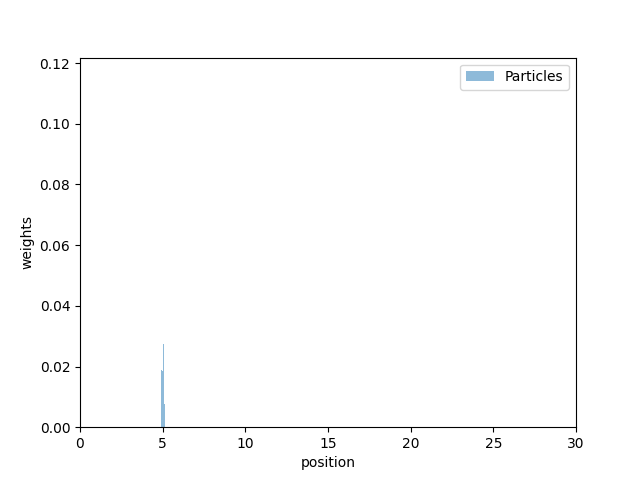
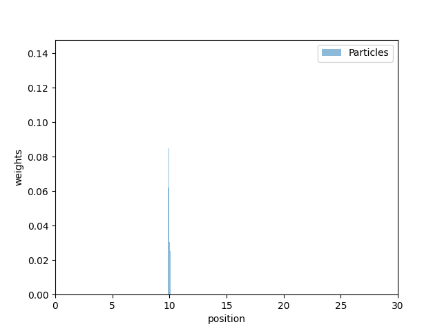

# MCL 1D
１次元の数直線上を動くロボットのMCL位置推定プログラム  
令和６年度　確率ロボティクス　課題

## パラメータ（pythonプログラム上で設定する）
```python
NUM_PARTICLES = 100  # パーティクルの数
WORLD_SIZE = 30      # 数直線の長さ
MOTION_NOISE = 0.1    # 移動で生じるばらつきの標準偏差
SENSOR_NOISE = 0.1    # 観測雑音の標準偏差
```

## 動作の例
ロボットは０から右に１ずつ進むため，１周期目の真値は１，２周期目は２・・・と進んでいく．

- 1周期目  


- 2周期目  


- 5周期目  


- 10周期目  


### ロボット位置と最大の重みをもつパーティクルの位置の出力
```
# Step 1
robot position: 1
max weight particle: 0.81 (weight: 0.0274)
# Step 2
robot position: 2
max weight particle: 2.01 (weight: 0.0221)
# Step 3
robot position: 3
max weight particle: 2.85 (weight: 0.0206)
# Step 4
robot position: 4
max weight particle: 4.08 (weight: 0.0330)
# Step 5
robot position: 5
max weight particle: 5.04 (weight: 0.0189)
# Step 6
robot position: 6
max weight particle: 6.03 (weight: 0.0169)
# Step 7
robot position: 7
max weight particle: 6.90 (weight: 0.0255)
# Step 8
robot position: 8
max weight particle: 8.03 (weight: 0.0202)
# Step 9
robot position: 9
max weight particle: 8.95 (weight: 0.0172)
# Step 10
robot position: 10
max weight particle: 9.94 (weight: 0.0153)
```

# アルゴリズムの説明
1. パーティクルの準備   ←`initialize_particles`
2. ロボットの移動（右に１進む）
3. 移動後のパーティクル更新 ←`motion_update`
4. 観測値の生成 ←相対位置として観測が可能であるものとしている
5. 観測値の反映 ←`sensor_update`
6. リサンプリング   ←`resample_particles`
7. プロット

# メソッドの説明
## initialize_particles
全てのパーティクルを初期位置に設定する．

## motion_update
移動量に雑音を追加する．
雑音は，`np.random.normal()`でガウス分布に基づいて生成された乱数である．  
σ（移動で生じるばらつきの標準偏差）は上記のパラメータにて設定する．  
このプログラムは１次元の数直線上を移動するため，単純に雑音を足し算し，数直線上の範囲内に収める処理のみを行っている．  

## sensor_update
ガウス分布の確率密度関数を用いて観測値と各パーティクルの位置の一致具合を計算する．  
σ（観測雑音の標準偏差）は上記のパラメータにて設定する．  
加えて全パーティクルの重みの合計が１になるように正規化する．  

## resample_particles
`np.random.choice()`を使用する．
これで重みの高いパーティクルは強調され，低いパーティクルは排除される．  
| 確率分布をパラメータに持った重み付けをしたサンプリングを行っているため，計算量はO(N+size)となる．（sizeはサンプリングする要素の個数のこと）  
